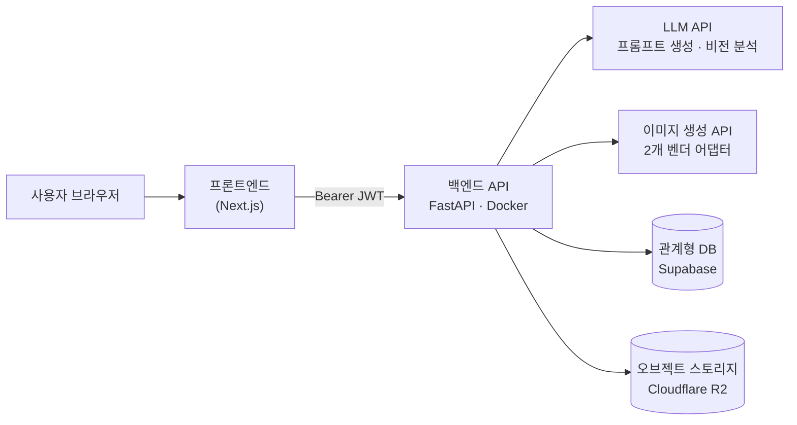
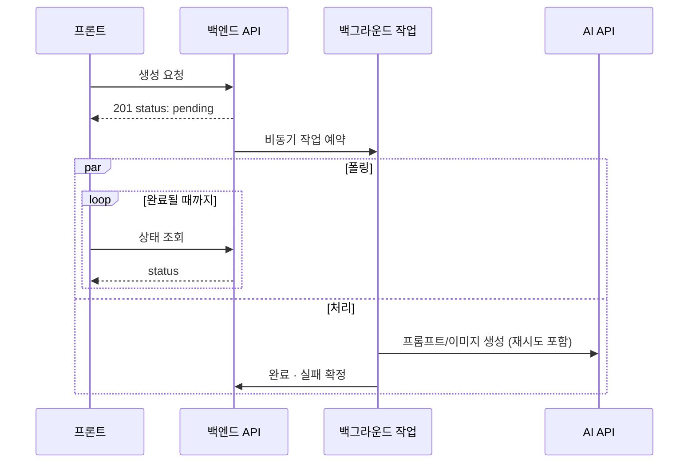
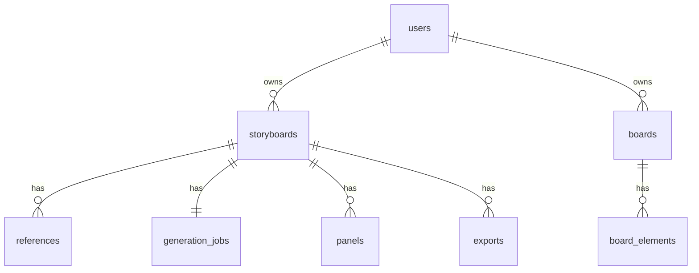

<div align="center">

# AI 스토리보드 자동 생성 백엔드


<br/>


</div>
<br/>

> 이 문서는 기업 프로젝트 참여 경험을 바탕으로 한 포트폴리오용 README입니다. <br/>
> 기업의 자산(실제 저장소·소스코드·API 명세·내부 문서·실명·도메인 등)은 포함하지 않으며, **문제와 해결 과정**을 중심으로 재구성했습니다.
<br/>

시나리오 텍스트 한 문단을 입력하면 <b>9컷 분량의 스토리보드(3×3 그리드 이미지 1장)</b>와 **영상 생성 AI에 바로 넣을 수 있는 영문 통합 프롬프트**를 자동으로 만들어주는 서비스의 백엔드 관련 문서입니다. 방송·영상 제작 분야 기업과의 협업 프로젝트에서, "기획 텍스트 → 콘티" 사이의 수작업 구간을 자동화하는 MVP를 검증하는 것이 목표였습니다.

---

## 목차

- [프로젝트 개요](#1-프로젝트-개요)
- [담당 업무](#2-담당-업무)
- [시스템 아키텍처](#3-시스템-아키텍처)
- [핵심 기능 — 생성 파이프라인](#4-핵심-기능--생성-파이프라인)
- [데이터 모델 (일반화)](#5-데이터-모델-(일반화))
- [기술적 의사결정](#6-기술적-의사결정)
- [트러블슈팅](#7-트러블슈팅)
- [성능 및 효율](#8-성능-및-효율)
- [회고](#9-회고)
- [API 설계 (예시)](#10-API-설계-(예시))

---

## 1. 프로젝트 개요

| 항목 | 내용 |
|---|---|
| 목적 | 시나리오 입력만으로 9컷 스토리보드 + 영상 AI 투입용 프롬프트를 자동 생성하는 MVP 검증 |
| 기간 | 2026년 7월, 약 3주 (백엔드 공백이 발생한 팀에 지원하여 인턴 합류) |
| 팀 구성 | PM 2 · Frontend 2 · **Backend 1 (본인)** · UI/UX 1 |
| 담당 직무 | Backend 전체 (API 설계 · AI 연동 · 인증 · 배포) |
| 기술 스택 | Python, FastAPI, SQLAlchemy, PostgreSQL(Supabase), Cloudflare R2, Anthropic Claude API, OpenAI Image API, Google Gemini API, Docker, AWS EC2, nginx, pytest |
| 개발 프로세스 | `feature/*` → `develop` → `main` PR 기반, 기능 단위로 반복 |

> [!NOTE]
> 이 프로젝트가 가장 검증하고 싶었던 건 "백엔드 구조의 완성도"가 아니라 <br/>
<b>"기획한 스토리보드 생성이 실제로 어느 정도까지 구현 가능하고 상용화 가능성이 있는가"</b>였다고 이해했습니다. <br/>
그래서 3주 내내 생성 파이프라인 자체의 품질(프롬프트 설계·이미지 처리 안정성)에 가장 많은 시간을 투자했고, <br/>
마이그레이션 도구 등 백엔드 정석 구성은 의도적으로 뒤로 미뤘습니다.

---

## 2. 담당 업무

- REST API 설계 및 구현 (인증 · 스토리보드 CRUD · 생성 파이프라인 · Export · 자유 배치 보드)
- DB 스키마 설계 (스토리보드-컷-생성-Export-보드 관계 모델링, 유저 소유권 기반 접근 제어 구조)
- 3개 AI (LLM 1종 + 이미지 생성 2종) 연동을 위한 어댑터 계층 설계
- 이미지 생성 파이프라인 설계 및 반복 튜닝 (프롬프트 엔지니어링)
- 인증/인가 시스템 구현 (JWT + 소셜 로그인, refresh token 로테이션)
- 오브젝트 스토리지 연동 (업로드 검증 · 병렬 업로드 · 파일 정리)
- 클라우드 배포 및 CI/CD 파이프라인 구성 (Docker, GitHub Actions, nginx)

---

## 3. 시스템 아키텍처



생성 작업은 평균 1분 내외 소요되어 요청-응답 사이클 안에서 끝낼 수 없었습니다. 그래서 백그라운드 작업 + 폴링 구조로 설계했습니다.



---

## 4. 핵심 기능 — 생성 파이프라인

| 단계 | 내용 |
|---|---|
| 1. 프롬프트 생성 | 한국어 시나리오 + 장르 프리셋 + (선택) 참고 이미지 → LLM이 영문 촬영 프롬프트로 변환 |
| 2. 이미지 생성 | 이미지 생성 모델이 3×3 그리드 1장(9컷 통합)으로 렌더링 |
| 3. 후처리 | 격자선 자동 탐지 → 9등분 크롭 → 컷별 이미지 확보 |
| 4. 산출 | 컷 9장 + 영상 AI에 바로 투입 가능한 통합 프롬프트 반환 |

**설계에서 가장 신경 쓴 지점 — 프롬프트를 용도별로 3겹으로 분리**

LLM이 쓴 프롬프트 원문을 그대로 두고, 용도에 따라 다른 것을 앞뒤로 붙이는 구조로 설계했습니다.

```
[LLM 원문]
   ├─▶ 이미지 생성 모델로 갈 때 = 기술 지시문(격자 규격) + 화풍 강제 문구 + 원문
   └─▶ 사용자에게 보여줄 때    = 컷별 재조립 + 화풍 태그
```

이미지 생성용 기술 지시(격자 규격 등)가 사용자에게 노출되는 최종 프롬프트에 섞이면 안 됐고, 반대로 이미지 모델에는 반드시 필요했기 때문입니다. 화풍(사진풍/애니메이션풍 등)도 LLM의 자유 재량에 맡기지 않고 사용자가 고른 값을 백엔드가 강제 주입하도록 설계했습니다.

---

## 5. 데이터 모델 (일반화)



- 생성 모드, 이미지 생성 모델 타입, 그림체 스타일 등 옵션 값은 Python `Enum` + SQLAlchemy로 관리
- 사용자별 독립적인 시퀀스 카운터로 기본 제목("스토리보드 3")을 자동 부여

---

## 6. 기술적 의사결정

| 결정 | 이유 |
|---|---|
| **AI 어댑터 패턴** | LLM 1종 + 이미지 생성 2종을 공통 인터페이스로 추상화. 벤더별로 다른 SDK 예외를 공통 타입(타임아웃/일시불가/요청오류)으로 정규화해서, 재시도·에러 처리 로직이 벤더 유형과 상관없도록 설계 |
| **레퍼런스 이미지 → 텍스트 매개 파이프라인** | 참고 이미지를 이미지 생성 모델에 직접 넣지 않고, LLM이 비전 분석으로 텍스트화한 뒤 그 텍스트만 이미지 생성 단계로 전달. 파이프라인 입력을 텍스트로 통일해 이미지 생성 벤더 교체 비용 최소화, 모델 종류 확장성 고려(이미지를 생성모델에 직접 넣으면 벤더별로 다르게 구현해야 함) |
| **인메모리 Rate Limiting** | Redis 없이 프로세스 메모리 기반으로 IP당 요청 수를 제한하는 최소 구현. 프로젝트 규모(소수 동시 사용자)에는 충분하지만 멀티 워커로 확장하면 무력화된다는 한계를 인지하고 설계 — 목적은 보안이 아니라 정상 사용자의 실수·버그로 인한 과도한 요청 방지 |
| **비용 기반 재시도 범위 설계** | 실패 시점이 비용 발생 전/후 어디인지에 따라 재시도 범위를 다르게 설계 — 비용이 이미 발생한 단계(이미지 생성) 이후의 실패는 전체를 다시 돌리지 않고 해당 단계만 저비용으로 재시도 |
| **동기(sync) 아키텍처** | 이미지 처리·PDF 생성·스토리지 업로드 라이브러리가 전부 블로킹 라이브러리라, async로 바꿔도 실효성이 낮다고 판단. 프레임워크가 기본 제공하는 스레드풀 동시성 + 필요한 곳만 병렬화로 대응 |
| **JWT 인증 구현** | 비밀번호 타이밍 어택 방지, refresh token 해시 저장 + 로테이션, 약한 시크릿 키로는 기동 자체를 거부하도록 설계 |
| **R2 스토리지 매직바이트 검증** | 클라이언트가 보낸 Content-Type은 위조 가능하므로 실제 파일 바이트 시그니처를 직접 검증 |
| **소유권 검사 = 404 (403 X)** | 존재 여부 자체를 숨기는 정책으로, 정보 누출 표면을 최소화 |

---

## 7. 트러블슈팅

### 문제 1. 이미지 생성 성공 후 후속 단계가 실패하면 비싼 재생성을 반복하게 됨

| &nbsp;&nbsp;&nbsp;&nbsp;&nbsp;&nbsp;&nbsp;| 내용 |
|---|---|
| **문제** | 이미지 생성 API 호출이 성공한 뒤, 후속 처리(크롭·업로드) 단계에서 실패가 나면 어떻게 복구할지 기준이 필요했음 |
| **원인** | 후속 실패라고 전체를 처음부터 다시 돌리면, 이미 성공한 값비싼 이미지 생성 API 호출까지 불필요하게 반복하게 됨 |
| **해결** | 실패 시점에 따라 재시도 범위를 다르게 설계 — 비용이 아직 발생하지 않은 단계는 전체 재시도, 비용이 이미 발생한 단계 이후의 실패는 그 단계만 저비용으로 재시도 |
| **결과** | 값싼 재시도로 성공하면 이미 생성된 이미지를 그대로 살려서 정상 완료, 그마저 실패해도 불필요한 이미지 재생성 비용은 발생하지 않음 |

### 문제 2. 장르마다 다른 프롬프트 튜닝 필요

| &nbsp;&nbsp;&nbsp;&nbsp;&nbsp;&nbsp;&nbsp;| 내용 |
|---|---|
| **문제** | 모든 장르에 동일한 프롬프트 규칙을 일괄 적용했더니, 특정 장르에서는 오히려 결과 품질이 떨어짐 |
| **원인** | 장르별로 서사 특성이 달라서, 동일한 세부 지시가 장르에 따라 정반대 효과를 냄 |
| **해결** | 장르를 특성별로 그룹화해 규칙을 선택적으로 적용하고, 결과를 반복 비교하며 튜닝 |
| **결과** | 장르 전반의 결과 품질·일관성 개선. "규칙을 무조건 늘리는 게 정답이 아니라, 대상 특성에 맞춰 선택적으로 적용해야 한다"는 걸 확인 |

### 문제 3. 그리드 이미지의 컷 분할 경계가 어긋남

| &nbsp;&nbsp;&nbsp;&nbsp;&nbsp;&nbsp;&nbsp;| 내용 |
|---|---|
| **문제** | 생성된 3×3 그리드 이미지를 컷 9장으로 자를 때, 균일하게 1/3·2/3 지점을 자르면 인접 컷이 조금씩 잘려 들어감 |
| **원인** | 이미지 생성 모델이 픽셀 단위로 균일한 격자를 그려주지 않고, 구분선 색상도 모델·장르에 따라 다르게 나옴 |
| **해결** | 예상 경계 근처 좁은 구간만 스캔해서 "주변 평균에서 가장 크게 벗어난(편차) 지점"을 실제 경계선으로 판정. 뚜렷한 신호가 없으면 균일 지점으로 안전하게 폴백하도록 설계 |
| **결과** | 구분선 색상·모델에 관계없이 안정적으로 9등분 크롭 성공, 관련 엣지케이스를 테스트로 커버 |

### 문제 4. 배포로 서버가 재시작되면 처리 중이던 작업이 방치됨

| &nbsp;&nbsp;&nbsp;&nbsp;&nbsp;&nbsp;&nbsp;| 내용 |
|---|---|
| **문제** | 생성 작업은 별도 백그라운드 처리로 도는데, 배포·재배포로 서버 프로세스가 재시작되면 그 작업이 그냥 사라지고 DB에는 "처리 중" 상태만 영구히 남음 |
| **원인** | 백그라운드 작업이 요청-응답 사이클과 분리되어 있어, 프로세스가 죽으면 작업 자체도 같이 사라지지만 DB 상태는 갱신되지 않음 |
| **해결** | 서버 기동 시점에 "처리 중" 상태로 남아 있는 작업을 일괄 조회해 실패로 정리하는 복구 로직을 `lifespan`에 추가 |
| **결과** | 재배포 후에도 사용자가 "영원히 로딩 중"인 화면을 보지 않고, 실패로 정상 안내받아 재시도 가능 |

### 문제 5. 로그인 응답 시간으로 가입 여부가 추측될 수 있음

| &nbsp;&nbsp;&nbsp;&nbsp;&nbsp;&nbsp;&nbsp;| 내용 |
|---|---|
| **문제** | 존재하지 않는 이메일로 로그인 시도하면 비밀번호 검증 자체를 건너뛰어 응답이 비정상적으로 빨라짐 |
| **원인** | 일반적인 조기 반환 로직 — 사용자가 없으면 바로 에러 반환 |
| **해결** | 사용자가 없어도 더미 해시에 대해 동일한 비밀번호 검증 연산을 수행해 응답 시간을 존재하는 계정과 동일하게 맞춤 (timing attack 방지) |
| **결과** | 응답 속도로 가입 이메일 여부를 추측하는 경로 차단 |

### 문제 6. 배포 후 대용량 파일 업로드가 실패함

| &nbsp;&nbsp;&nbsp;&nbsp;&nbsp;&nbsp;&nbsp;| 내용 |
|---|---|
| **문제** | 로컬에서는 되던 이미지/영상 업로드가 배포 서버에서만 실패 |
| **원인** | 애플리케이션 레벨 업로드 제한과는 별개로, 앞단 웹서버가 기본값으로 요청 바디 용량을 훨씬 작게 제한하고 있었음 |
| **해결** | 웹서버 설정에서 업로드 허용 용량을 애플리케이션 상한보다 넉넉하게 상향 조정 |
| **결과** | 업로드가 정상 작동하게 됨. "애플리케이션 코드의 제한"과 "앞단 웹서버의 제한"이 별개로 존재한다는 걸 배운 계기. |

---

## 8. 성능 및 효율

- **크롭 후 타일 업로드 병렬화**: 그리드 이미지를 9등분한 뒤 컷 9장을 순차 업로드하지 않고 병렬로 처리해 후처리 시간 단축
- **LLM 프롬프트 캐싱**: 매 호출 동일한 시스템 프롬프트에 캐싱을 적용해 반복 호출 시 토큰 비용 절감
- **업로드/다운로드 최적화**: 참고 이미지는 서버에서 자동 축소 후 저장(모델 입력 토큰 절감), 대용량 파일은 스트리밍 방식으로 검증(전체를 메모리에 올리지 않음)
- **참고 이미지 병렬 업로드**: 여러 장을 순차 업로드하지 않고 병렬로 처리해 대기 시간 단축
- **DB 인덱싱**: 유저별 스토리보드/캔버스 조회처럼 자주 필터링되는 외래키 컬럼에 인덱스를 적용해 조회 성능 확보
- **PDF Export 이미지 다운스케일**: 페이지 크기보다 큰 이미지를 줄여서 삽입해 PDF 파일 용량 최적화

---

## 9. 회고

**배운 점**
- 여러 벤더의 서로 다른 API를 하나의 추상화로 묶는 경험을 통해, 향후 확장성을 고려했을 때 왜 이런 설계가 필요한지 체감했습니다. 또한 "비용이 이미 발생했는가"를 기준으로 에러 처리 전략을 분기하는 사고방식을 배웠습니다.
- AI 프롬프트를 설계하고 깊이 있게 튜닝해보면서, 프롬프트 엔지니어링은 감이 아니라, 가설을 세우고 검증을 반복하며 다듬어가는 영역이라는 걸 느꼈습니다.
- 완벽한 아키텍처보다 제한된 시간 안에 무엇을 검증해야 하는지가 중요하고, 의뢰한 업체가 가장 우선시하는 것이 무엇인지 먼저 파악하고 그에 맞춰 개발 방향을 조정하는 것이 중요하다는 것을 깨달았습니다.
- 백엔드 전체를 단독으로 책임진 것도, 프론트엔드 팀원들과 API 계약만으로 소통하며 협업한 것도 모두 처음이었습니다. 다양한 실무 형태를 경험하며 실전 감각을 넓히는 계기가 되었습니다.
- PM 팀원들이 진행 중에 우선순위를 정리해주고 발표 당일 결과물을 효과적으로 전달했을 때, UI/UX 팀원이 디자인을 전담해 결과물의 완성도를 높여줬을 때, 개발 역량만큼이나 각 역할 간의 협업이 프로젝트 전체 완성도를 좌우한다는 것을 체감했습니다.

**아쉬웠던 점과 향후 개선 방향**
- AI 호출 비용을 재시도분까지 포함해 추적하는 체계를 만들지 못했습니다. 상용화를 고려한다면 재시도분도 비용에 포함하고 AI 호출 단위로 사용량과 비용을 기록하는 usage 테이블 설계가 필요하다고 생각합니다. 개발 단계에서도 프론트가 실제 AI 호출 없이 테스트할 수 있는 mock 응답 계층을 만들어뒀다면 개발 비용을 더 아낄 수 있었을 것 같습니다.
- 스키마 마이그레이션 도구와 배포 파이프라인의 자동 테스트를 도입하지 못했습니다. 시간이 넉넉했다면 DB 전체를 초반에 구현한 후 마이그레이션 도구를 바로 도입하고 배포 CI 테스트도 추가했을 것 같습니다.
- 콘텐츠 정책처럼 에러 응답이 사유별로 정확히 구분되지 않는 문제 등 정밀하게 다루지 못한 에러 처리 영역이 남아 있습니다. AI 정책 판단 기준이 항상 일관되지 않고 벤더마다 에러 형태도 달라서, 정확한 사유를 안내하려면 벤더별 분기 로직이 추가로 필요했는데 우선순위에 밀려 다루지 못했습니다. 에러를 원인별로 정확히 분류하도록 개선해야 합니다.
- 스토리지 계층(R2)이 실패 시 웹 프레임워크(FastAPI)의 예외를 직접 던지는 구조가 남아 있어, 각자 계층에 맞는 예외를 던지지 못하고 있습니다. 스토리지 파일은 스토리지 자체의 예외만 던지고, 라우터 파일은 스토리지 파일에서 던진 예외를 받아서 여기서만 웹 계층(http) 예외를 던지도록 개선해야 합니다. 이렇게 하면 스토리지 코드를 재사용하기도 쉽고, AI 에러 처리처럼 스토리지(R2) 에러도 원인을 정확히 알 수 있고 로그를 남기기 수월해집니다.
- MVP가 아니라 정식 프로그램이 된다면 무거운 백그라운드 작업은 전용 워커 큐로 분리하는 것을 시도해야 한다고 생각합니다.

---

## 10. API 설계 (예시)

> [!NOTE]
> 실제 엔드포인트/도메인이 아닌 예시로 일부만 재구성했습니다.

```
POST   /storyboards                 시나리오 입력 + 생성 요청
GET    /storyboards/{id}            스토리보드 상세 조회
GET    /generations/{id}            생성 진행 상태 조회 (폴링)
POST   /storyboards/{id}/exports    PDF/이미지 내보내기
POST   /auth/login                  로그인
POST   /auth/refresh                토큰 갱신
 ⁞
```

모든 응답은 `{ "detail": "..." }` 형태의 일관된 에러 포맷을 따르며, 인증이 필요한 전 엔드포인트는 `Authorization: Bearer <token>` 헤더를 검사합니다. 소유하지 않은 리소스 접근 시에는 존재 여부 자체를 숨기기 위해 `403` 대신 `404`를 반환합니다.
